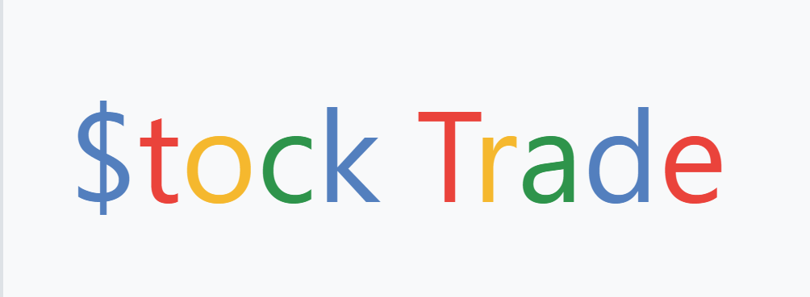
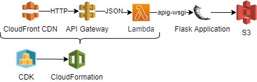

<!---->
# Stock-Trade

<!--A stock trading simulator web app via which users can buy and sell stocks with real-time prices from the IEX stock exchange.-->A web app that allows users to track real-time stock prices, providing users with personal accounts including stock portfolios and transaction histories. <!-- Check out $tock Trade <a href="https://d1swsc7pdfwfna.cloudfront.net/" target="_top">here</a>! -->

## AWS Infrastructure

I decided to change up the infrastructure of the project from Heroku to AWS Lambda, hence the two directories.

The previous deployement can be found in the StockTrade-HerokuApp_DEPRECATED directory; this was a simple deployment of the app to Heroku.

Due to Heroku removing their free tier as of December 2022, and to gain more control over the infrastructure, I decided to switch to AWS for hosting this web app.

I utilized the AWS CDK to provision my desired infrastructure using TypeScript code to produce an AWS CloudFormation stack and templates for AWS resource configuration and deployement. 

The current and upgraded version of this web app (deployed to AWS through an AWS CDK setup) can be found in the StockTrade-CDKapp directory.

Here is a flowchart of what the current infra of this web app looks like:

<!--       -->
<!--[Python](https://img.shields.io/badge/-Python-yellow) [Flask](https://img.shields.io/badge/-Flask-green) [PostgreSQL](https://img.shields.io/badge/-PostgreSQL-orange)-->

<!--## ✨ Features
- Intuitive interface that allows users to view their stock portfolios and transaction history.
- Fully functioning user account system utilizing a PostgreSQL database and Flask sessions.
- Real time stock prices obtained using the IEX stock exchange API.
-->

<!-- ## ⚙ Installation 

1. `git clone https://github.com/Iliaromanov/Stock-Trade.git`

2. `cd Stock-Trade`

3. `pip install -r requirements.txt`

4. `python app.py` -->

<!--Made with ❤ by [Ilia](https://github.com/Iliaromanov) 😁
https://ilia-stock-trade.herokuapp.com/-->
